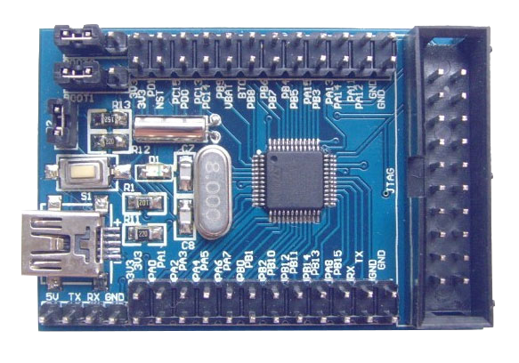

# Gentle introduction to STM32 ARM Cortex microcontrollers and boards programming

So you have been using AVR, PIC or some other microcontroller for a while and
discover that ST Microelectronics offers some pretty cheap 32 bit ARM and
feature rich microcontrollers:
[STM32](http://www.st.com/content/st_com/en/products/microcontrollers/stm32-32-bit-arm-cortex-mcus.html?querycriteria=productId=SC1169),
and want to start playing with them but don't know how or where to start; I'm
here to help.

[ARM](https://en.wikipedia.org/wiki/ARM_architecture) is taking over the
embedding wold, they're ubiquitous in smart phones, tablets, laptops, other
computers, cars, refrigerators, microwave ovens, monitors, printers, you name
it!

Note: Be aware that *ARM* is an **architecture** that manufacturers can
*implement*. Is a common mistake to think *ARM* is a microcontroller on
itself, it is not.

If you were using AVR or PIC going to a 32 bit ARM chip is a big step
forwards.

## Hardware

As I mentioned STM32 chips are very inexpensive and widely available as
individual chips, mounted in convenient development boards or breakout boards.

Individual chips can be bought from electronic stores like Digi-Key or Mauser,
but for the current purposes make your own PCB to mount them is quite
inconvenient.

The other option is to get one of the nice development boards ST offers:

* [Eval](http://www.st.com/content/st_com/en/products/evaluation-tools/product-evaluation-tools/mcu-eval-tools/stm32-mcu-eval-tools/stm32-mcu-eval-boards.html?querycriteria=productId=LN1199)
* [Nucleo](http://www.st.com/content/st_com/en/products/evaluation-tools/product-evaluation-tools/mcu-eval-tools/stm32-mcu-eval-tools/stm32-mcu-nucleo.html?querycriteria=productId=LN1847)
* [Discovery](http://www.st.com/content/st_com/en/products/evaluation-tools/product-evaluation-tools/mcu-eval-tools/stm32-mcu-eval-tools/stm32-mcu-discovery-kits.html?querycriteria=productId=LN1848)

Although these are cheap and amazing, we can go even cheaper with the great
breakout boards available on Ebay. You can get a STM32F103 chip in a nice board
for less than $5.

### Programmer

STM32 chips are programmed using a
[ST-LINK](https://en.wikipedia.org/wiki/ARM_architecture) device, which is an
in-circuit debugger and programmer that interfaces with the chip using JTAG or
Serial Wire Debugging (SWD). This is similar to the USBASP for AVR or the PICKIT
for PIC.

Development boards like the *Nucleo* include the st-link hardware directly into
the board, so you can connect it to a host computer using USB and program/debug
the target chip on the board without any additional external hardware.

If you're using another breakout board (like the Ebay ones) or if you mounted a
chip in a custom PCB, you will need an external st-link hardware. Fortunately
they are also available for cheap on Ebay or you can buy the official one for a
few extra bucks if you prefer, they both will work exactly the same with the
flashing software.

#### Connections

If you're using a ST development board with the st-link built in just connect it
to your computer and you're ready to go, but for breakout boards and a dongle
st-link you'll need to connect four wires to it:

* VCC (3.3V)
* GND
* SWCLK
* SWDIO

**WARNING:** STM32 chips run on 3.3V, most breakout boards will include a
voltage regulator so it can be powered from USB, and st-link dongles will
provide a 3.3V VCC PIN to power up the chip. **DON'T** Connect the board to the
PC using USB while the chip is powered up using the st-link programmer! Connect
one or the other but not both simultaneously.

ST-Link dongles has labeling on the front, just connect the right pins. On the
board side, follow the labeling printed on the pins or use a JTAG/SWD pin out
diagram if your board has a JTAG/SWD connector like mine. The connections for
the st-link on the breakout board I'm using looks like this:

